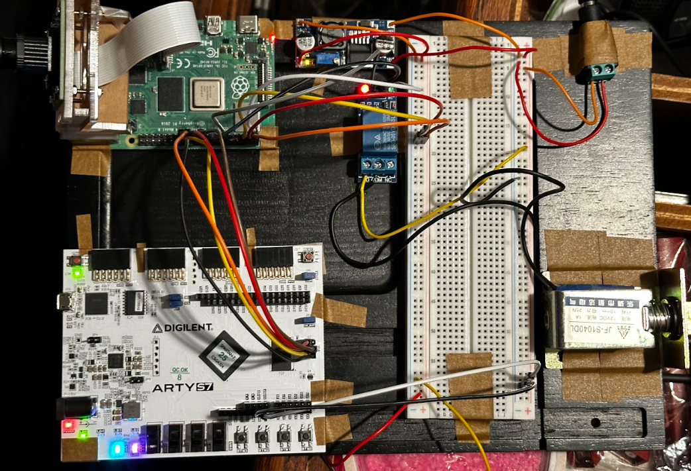

# Security Video Smart Lock



## Overview

This project is a smart lock system that uses face recognition.
It is best used in a Linux environment, but it can also work in other environments.

## How it works

The ```main.py``` script serves as the entry point to initiate the program.

The ```recognize_faces.py``` script is structured to train a face recognition algorithm to recognize specific individuals by loading sample images, extracting face encodings, and then comparing these encodings against faces found in other images to identify them. The script defines a function recognize_faces(image) that takes an image as input, detects faces within it, and attempts to recognize these faces based on the known face encodings. This process involves loading and encoding sample images for known individuals (in this case, "Ronny" and "Obama") and then using these encodings to identify matches in the input image.

The ```camera_module.py``` script is responsible for capturing frames from the camera, processing them to detect and identify faces using the recognize_faces function imported from recognize_faces.py, and then displaying the video feed with boxes and names drawn around recognized faces. The script uses OpenCV for video capture and processing, including resizing frames for faster processing and toggling between processing frames to improve performance.

The ```lock_module.py``` script enables a Raspberry Pi to control a door lock using GPIO pins and threading for asynchronous operation. It initializes the lock mechanism and manages locking/unlocking actions based on person detection. The unlock_door function unlocks the door if a specified person is detected, with a cooldown period to prevent frequent unlocking. A threading.Timer is used to re-lock the door automatically after a short period. This setup allows for a background thread to handle the lock's state while the main program runs in parallel.

## Dependancies

Some packages needed for the project to run:
* face_recognition_models
* OpenCV
* Click>=6.0
* dlib>=19.3.0
* numpy
* Pillow
* scipy>=0.17.0

face_recognition_models: Contains the pre-trained models used for detecting and recognizing faces.

Click>=6.0: A package for creating command-line interfaces in a composable way, used for handling the program's input parameters or configuring settings through the command line.

dlib>=19.3.0: A toolkit for machine learning and image processing, used for its efficient face detection and recognition algorithms which are crucial for identifying faces within images.

numpy: A fundamental package for scientific computing with Python, used for handling and manipulating the array data structures that represent images and video frames.

Pillow: The Python Imaging Library adds image processing capabilities to your Python interpreter, used for opening, manipulating, and saving many different image file formats within the program.

scipy>=0.17.0: A library used for scientific and technical computing, used for tasks like image manipulation, facial feature extraction, or even to support the machine learning algorithms with functions for optimization and linear algebra.

## Installation

*Note: For linux/MacOS be sure to use pip3/python3*

Before starting, make sure that your Python installation includes pip. You can ensure this by running:

```sh
python -m ensurepip --upgrade
```

This project uses an open-source facial recognition library. You can clone the repository with:

```sh
git clone https://github.com/ageitgey/face_recognition.git
```

Some Pre-reqs to install if you don't have it (needed for dlib)
```sh
sudo apt-get update
sudo apt-get install cmake
sudo apt-get install build-essential libopenblas-dev liblapack-dev 
```

Navigate to the cloned repository and install the necessary packages:

```sh
cd face_recognition
pip install -r requirements.txt
```

On raspi you might need to bypass security measures on pip installs
```sh
pip3 install --break-system-packages -r requirements.txt
```

After that, install the face recognition library:

```sh
pip install face_recognition
```

This project also uses OpenCV for face tracking. You can install it with:

```sh
pip install opencv-python
```

For lock GPIO
```sh
sudo apt-get install python3-rpi.gpio
```

SPI Protocol on Raspi
```sh
pip install spidev
```

## Usage

After installing the necessary packages, you can start using the project.

```sh
python main.py
```

## Rasberry Pi (Linux)

Some things to consider.

1. When SSHing into the raspi consider using MobaXterm on your local machine so you can display graphical windows via SSH using X11 forwarding. This allows the graphical interface to be displayed on your local machine even though the program is running on the Raspberry Pi.

## Contributing

If you want to contribute to this project, please follow these steps:

- 1. Fork the project
- 2. Create your development branch (`git checkout -b development/feature`)
- 3. Commit your changes (`git commit -m 'Added some feature'`)
- 4. Push to the branch (`git push origin development/feature`)
- 5. Open a pull request

## Contact

- Ronny Ismael
- Cary Zheng
- Michael Zabaneh
- Mohammad Zaza
